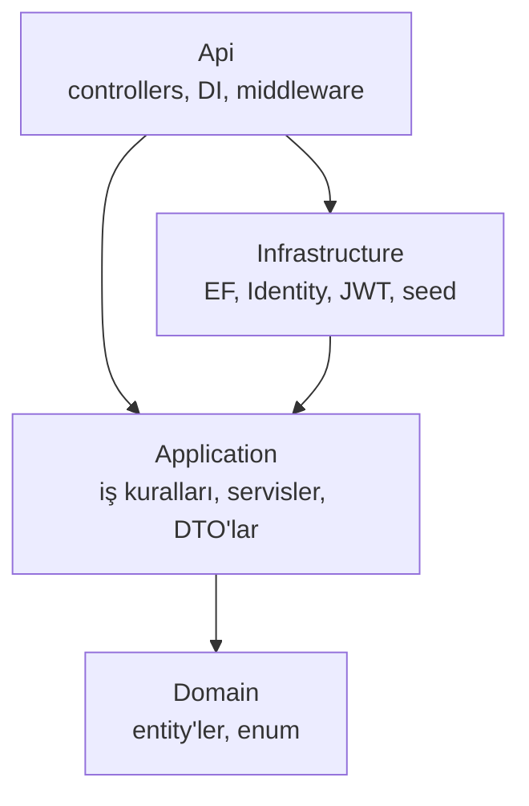
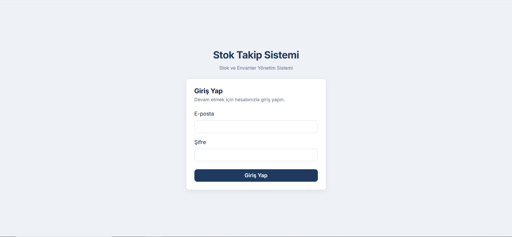
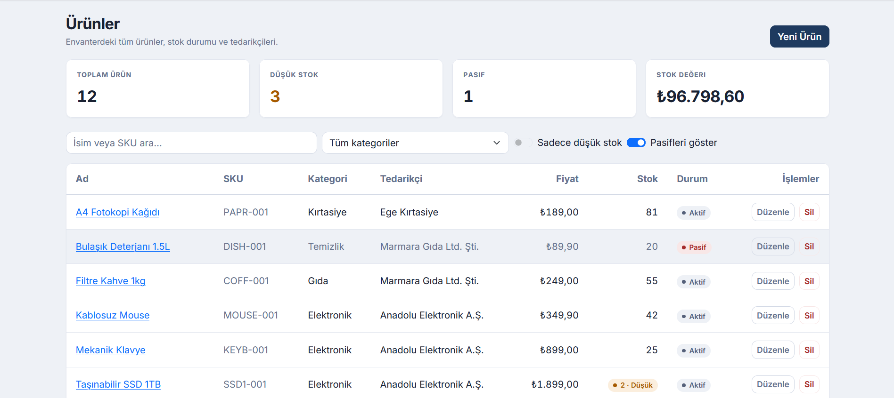
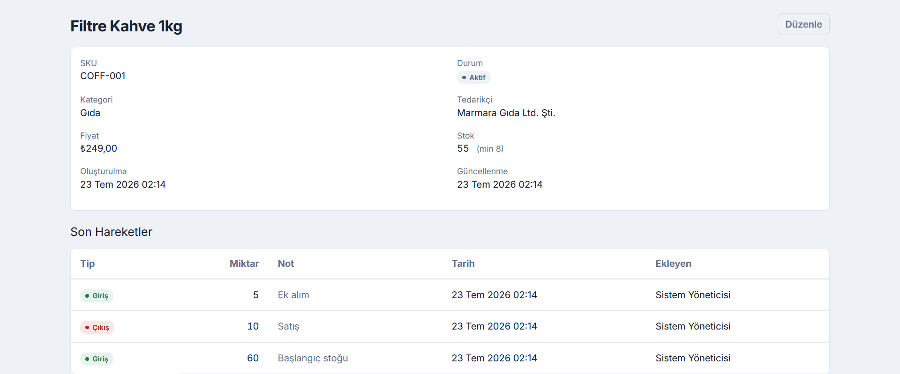
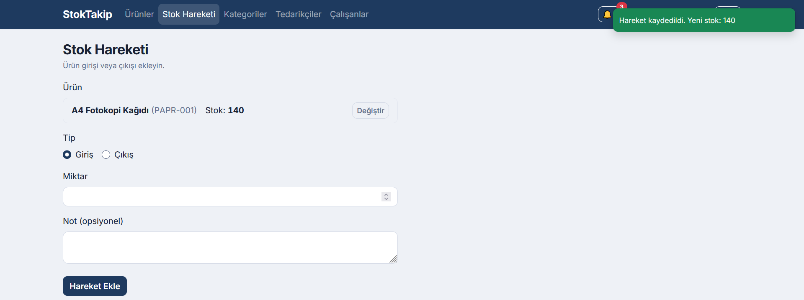
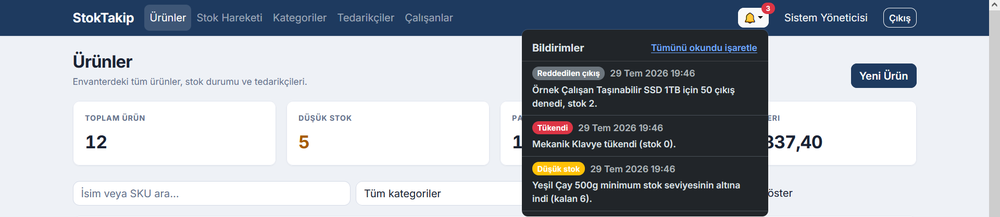

# StokTakip — Stok Takip Sistemi

ASP.NET Core final projesi. Ürün, kategori ve tedarikçi yönetimi ile
append-only stok hareket defteri sunan; rol tabanlı yetkilendirmeye sahip
tam yığın (full-stack) bir web uygulaması.

## Amaç

Küçük/orta ölçekli bir işletmenin ürün envanterini, tedarikçilerini ve
stok giriş/çıkış hareketlerini tek yerden yönetmesini sağlar. **Admin**
kullanıcılar tüm katalogu (kategori, tedarikçi, ürün) yönetir ve çalışan
hesapları açar. **Çalışan** kullanıcılar katalogu görüntüler ve stok
giriş/çıkış hareketi girer. Stok hareketi girişi operasyonel veri olduğundan
her iki role de açıktır; katalog düzenleme ve kullanıcı yönetimi yalnız
admin'dedir.

## Özellikler

- Kategori, tedarikçi ve ürün için tam CRUD.
- Stok giriş/çıkış hareketleri; hareket kaydı ile stok miktarı tek işlemde güncellenir.
- Ürün araması (ad, SKU, kategori, tedarikçi); kategori, tedarikçi, düşük stok ve pasif
  kayıt filtreleri; sayfalama.
- Düşük stok ve pasif ürün rozetleri, stok değeri özeti.
- Gerçek zamanlı envanter: bir kullanıcının girdiği hareket, açık olan diğer oturumların
  ürün listesinde ve özet kutularında sayfa yenilemeden görünür.
- Bildirimler: düşük stok, tükenme ve yetersiz stok nedeniyle reddedilen çıkış olayları
  admin'in zil rozetine anlık düşer. Kayıtlar veritabanında tutulur; admin çevrimdışıyken
  üretilenler girişte görünür.
- Eşzamanlılık koruması: aynı ürünü iki kişi aynı anda düzenlerse ikincisi çakışma uyarısı
  alır, kayıp güncelleme oluşmaz.
- Rol tabanlı yetkilendirme (Admin / Çalışan), JWT ile oturum.
- Çift taraflı form doğrulama (backend DataAnnotations + frontend zod).

## Teknolojiler

**Backend**
- ASP.NET Core Web API (.NET 10, Controllers)
- Entity Framework Core 10 + Npgsql (PostgreSQL sağlayıcısı)
- PostgreSQL
- ASP.NET Core Identity + JWT Bearer (rol tabanlı yetki: Admin / User — UI'da "Çalışan")
- SignalR (gerçek zamanlı sinyal katmanı; hub yolu `/hubs/stok`)
- Swagger (Swashbuckle) — yalnız geliştirme ortamında

**Frontend**
- React 19 + TypeScript (strict) + Vite
- react-router, Zustand (auth state), TanStack Query (server state)
- react-hook-form + zod (form doğrulama)
- Bootstrap 5 + react-bootstrap
- axios (JWT interceptor)
- @microsoft/signalr (hub istemcisi, otomatik yeniden bağlanma)

**Altyapı**
- Docker + Docker Compose (multi-stage build)
- nginx (frontend statik sunum, `/api` ters proxy ve `/hubs` WebSocket upgrade)

### Mimari

Yalın Onion mimarisi — bağımlılıklar yalnızca içe doğru akar:



- **Domain** — framework bağımsız POCO entity'ler ve enum.
- **Application** — iş kuralları, servisler, DTO'lar; `IAppDbContext` soyutlaması üzerinden çalışır, veritabanı sağlayıcısını tanımaz.
- **Infrastructure** — EF Core DbContext, migration'lar, seed, Identity ve JWT üretimi.
- **Api** — ince controller'lar, bağımlılık kaydı, middleware, SignalR hub'ı. Application yalnız framework bağımsız bir bildirim arayüzü tanır; SignalR'a referans vermez.

## Kurulum

### Gereksinimler
- Docker Desktop (çalışır durumda)
- Boş portlar: `3000` (web), `5433` (PostgreSQL)
- İlk kurulumda imaj indirmek için internet bağlantısı

### Çalıştırma

```bash
git clone https://github.com/samet-6/Stok-Takip-Sistemi.git
cd Stok-Takip-Sistemi
docker compose up -d --build
```

Servisler ayağa kalktığında uygulama şu adreste hazırdır:

**http://localhost:3000**

Uygulama ilk açılışta veritabanı şemasını oluşturur ve örnek verilerle
(4 kategori, 3 tedarikçi, 12 ürün, 22 stok hareketi) doldurur. Aralarında bilerek
birer pasif tedarikçi ve pasif ürün vardır; listelerde soluk görünmeleri normaldir.
Ek bir komut gerekmez.

Durdurmak için: `docker compose down`
Verileri de silerek sıfırlamak için: `docker compose down -v`

## Giriş Bilgileri

Uygulama, tohum (seed) verisiyle hazır hesaplar oluşturur:

| Rol | E-posta | Şifre |
|---|---|---|
| Admin | `admin@stok.local` | `Admin123!` |
| Çalışan | `user@stok.local` | `User123!` |

Uygulamada herkese açık kayıt (register) ekranı yoktur: yeni çalışan hesapları
admin tarafından "Çalışanlar" ekranından açılır, çalışan çıkarma işlemi silme
değil pasifleştirmedir. Yukarıdaki çalışan hesabı, rol ayrımını denemek için
hazır gelir.

> `docker-compose.yml` içindeki veritabanı şifresi, JWT anahtarı ve seed
> şifreleri **demo değerlerdir** ve projenin tek komutla çalışabilmesi için
> bilinçli olarak depoda paylaşılmıştır. Gerçek bir dağıtımda bu değerler bir
> secret manager üzerinden yönetilir.

## Ekran Görüntüleri






